# CROWDFUNDING PLATFORM ✨

## Brief Description 
A crowdfunding platform where user can browse through different campaigns and support the cause by donating some amount of money.
The payment is done via the PayTM gateway & complete transparency and anonymity of the process is ensured.

## Features and Functionalities 😃

**User features**
 - User can see the ongoing campaigns on the landing page.
 - User can click on the campaign they want to support and then be directed to the specific campaign page where they can see the campaign details.
 - User can then support the campaign by donating the amount they would like to via PayTM.
 - User can also share the campaign among their friends/colleagues/relatives to increase the reach of the campagin via the share-feature.
 - User can see the amount details of the transaction after the payment is done on that campaign page in the List of Donation. (Anonymity is ensured)
 - User can send us their queries via the form provided in the 'Contact-Us' section.
 
 **Admin features** 
 
 - All above features are included for the admin as well.
 - Admin can start a new campaign by filling in the project details such as campaign title, required amount etc.
 - Admin can deactivate an ongoing campaign when the need is fulfilled or before (due to any possible reason).
 - Admin can edit the details of an ongoing campaign (not allowed to change the raised amount).
 - Only an admin can add another new admin (if required, for any purpose). 
 
 **CRUD** functions can be called by users to perform different types of operations on selected data within the database. 

 **Note** : We have created a default admin. The route for the LOGIN section is not kept in the UI. One can access it through website_url/admin/login where they are required to   enter the login credentials. The motive behind doing this was that we thought it would seem a bit weird for the general users to be able to see the LOGIN section when there is no need of it to make a payment which is the prominient feature in our website.
 
 ## Tech Stack 💻
 
 **MERN** stack has been used for the development of this website. 
 - [React.js](https://reactjs.org/)
 - [Node.js](https://nodejs.org/en/)
 - [Express.js](https://expressjs.com/)
 - [MongoDB Atlas](https://www.mongodb.com/cloud/atlas)

## API :man_technologist:

 - [PayTM API](https://developer.paytm.com/docs/)
 
## Components include:
 - API calling (calling to PayTM gateway)
 - Usage of MongoDB that provides us a Schema-less Database and ensures high performance and efficiency.
 
 ## Thought behind the project
 
This project is a part of the Winter Project event conducted by AASF IIITM. Our motive behind choosing this project was to build a platform that can come to practical use in real world. We saw the need of a crowd-funding webapp for our **ROTARACT CLUB** in IIITM that can provide smooth functionality as well as transparency of payments for the various campaigns/charities carried out via ROTARACT. So, we decided to come up with  this project that can provide a good user experience as well as ensure the transparency of the payments carried out. And, also serve as a platform working for a good cause. 

## Hosted on Vercel
Link : https://crowd-funding.vercel.app/

## SetUp Steps

### Prerequisites
npm installed, Paytm id, MongoDB URI, create-react-app installed, etc.  
### For Backend
 - Go to backend folder.
 - Run npm install
 - Set Up Environment variable as shown in `env-sample` file.
 - Run `node ./server.js`
 
### For Frontend
 - Go to `Frontend/crowd-funding-frontend` folder.
 - Run `npm install`
 - Put backend url in config.js
 - Run `npm start`
 
**Hurray, Your app is now running on port 3000 in your browser**

## Screenshots

### Landing Page

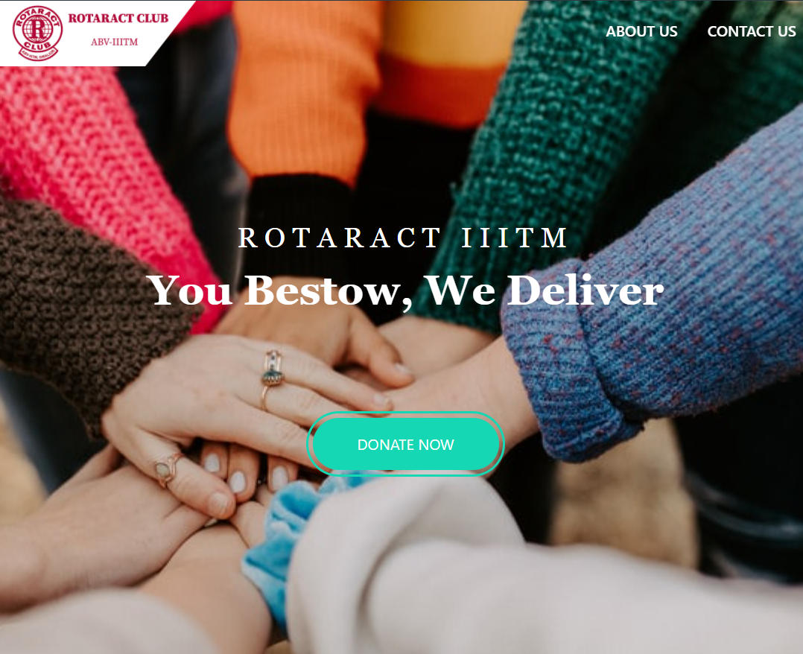

On Clicking Donate Button, we can slide through the Ongoing Camapigns section

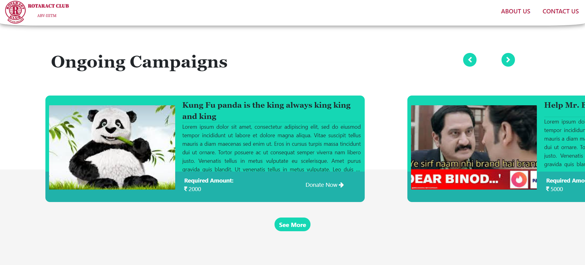

### Campaign Page

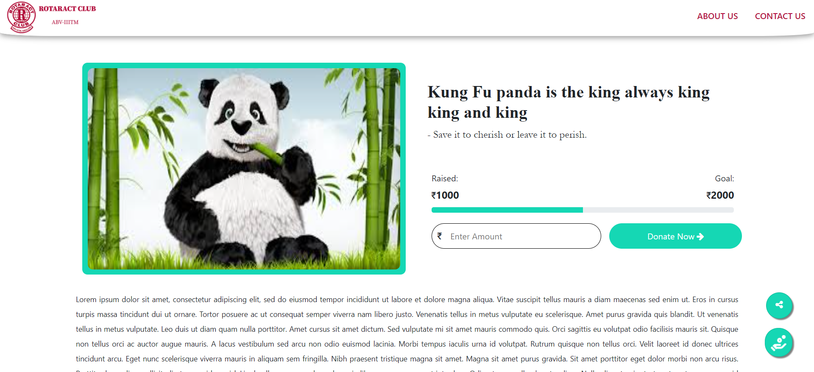

Donors List (Amount and Transaction ID) for transparency 

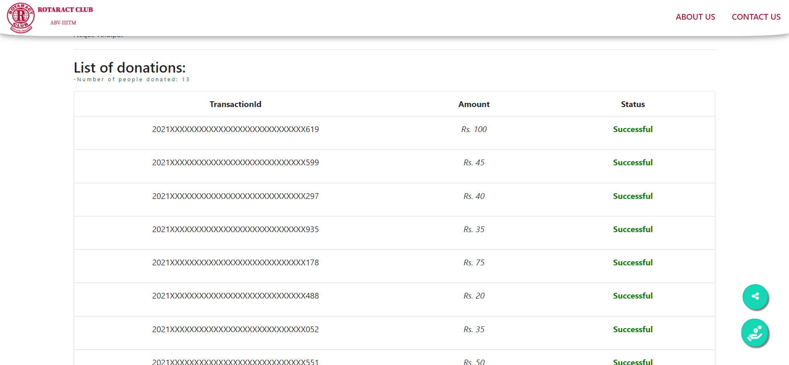

Here some part of Transaction ID is hidden for security purpose (from backend as well as frontend).

### Instant share and donate buttons

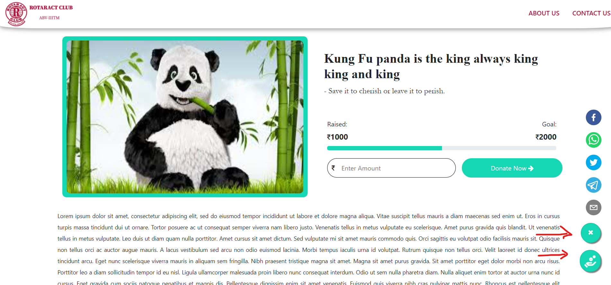

### All Campaigns

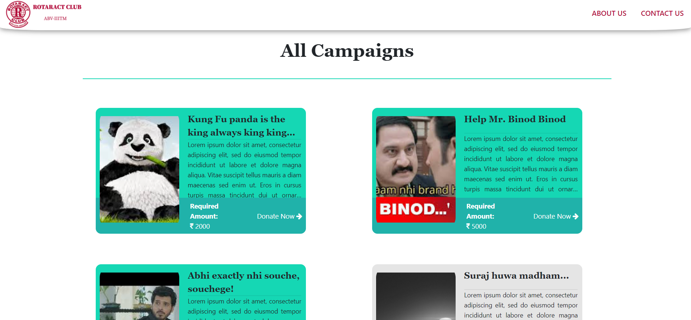

### Login Page

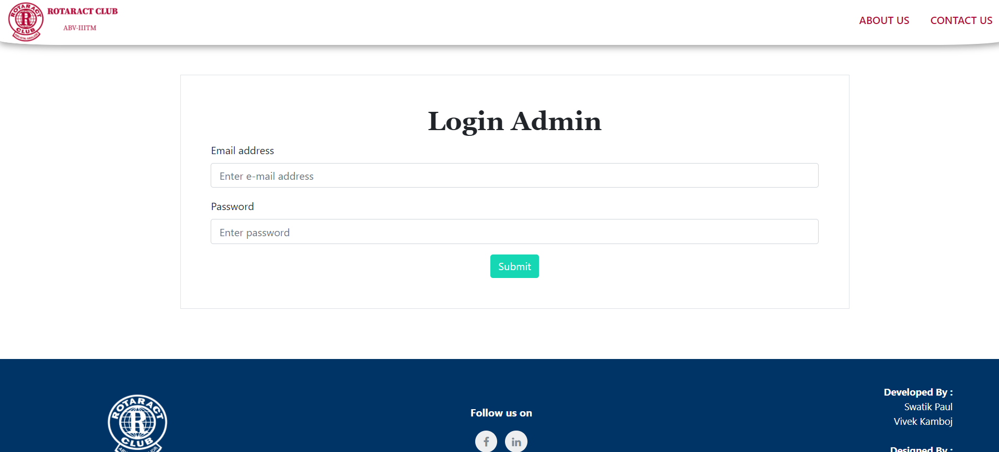

### Admin DashBoard

Here in bottom we can see message from the Feedback Form present in the Contact us page.

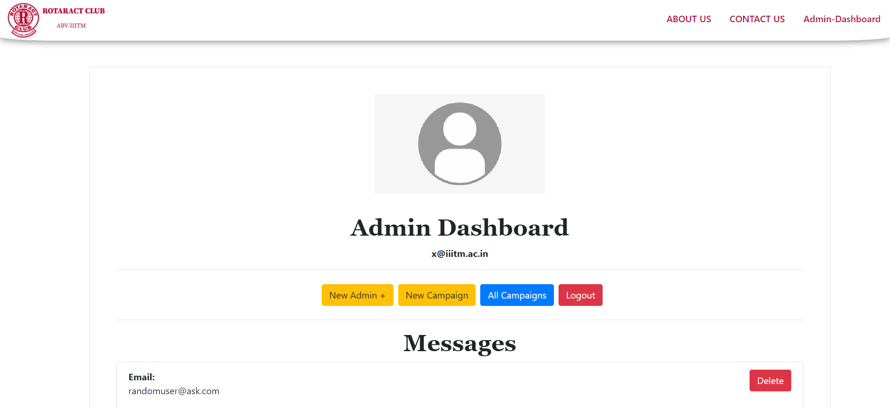

### About Us Page

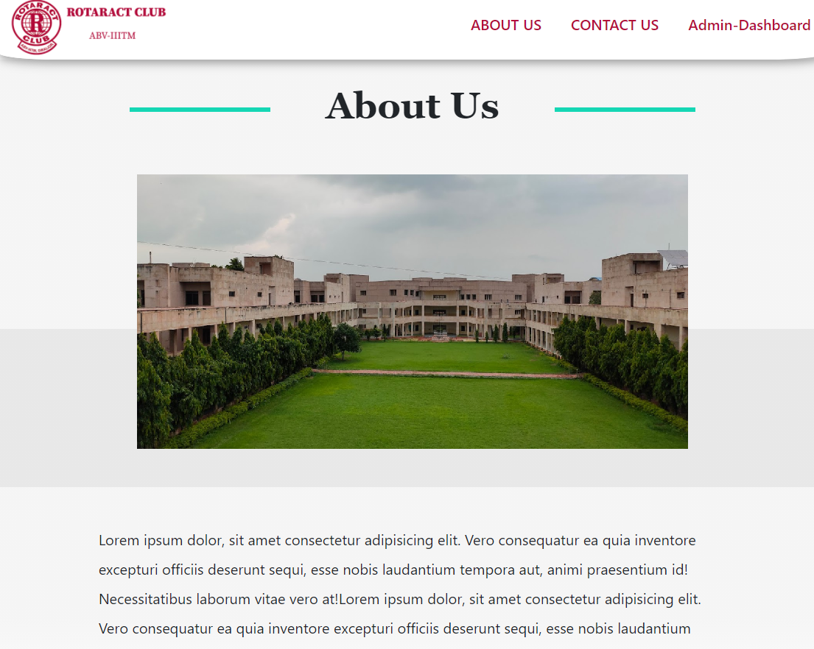

### Conatact Us Page

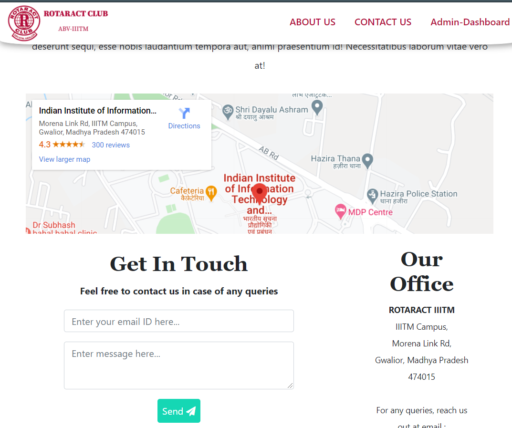

### Footer

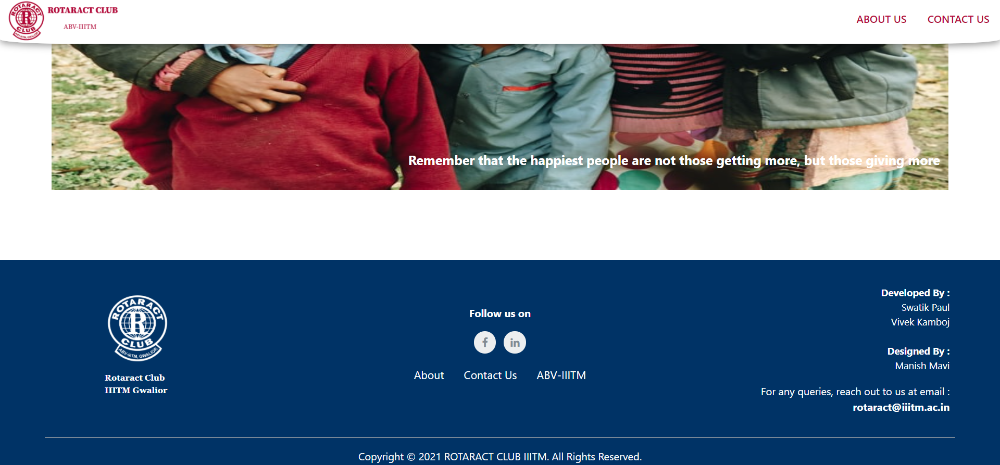

## Video Demo

[Click for Demo](https://youtu.be/Xl-5Blm3Pm8)
